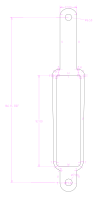

# Sig SHR 970 resources
A collection of resources for the SHR 970, a hunting rifle which is not produced any more.

### Purpose
As a SHR 970 owner, maintaining and improving the rifle is challenging. The aim of this page is to collect useful material about the rifle.

### History
SHR 970

STR 970

SHR970 and STR970
Both rifles use the same SHR action. The only difference between the two is that the SHR970 comes with a choice of either a wood or synthetic stock (believed to be a Bell & Carlson) while the STR970 has a McMillan stock (similar to an A3) and a heavy-fluted barrel with an integrated muzzle brake. Interestingly, some STR970's were made with receivers marked "SHR" instead of "STR".

ROUGH TIMELINE
1998
SIGArms imports the SHR 970 from Swiss Arms Neuhausen, a SIG Holding AG related entity.

2000
SIGArms imports the STR 970 from Swiss Arms Neuhausen, a SIG Holding AG related entity.

2001
SIGArms stops importing the 970 series and disperses remaining SHR/STR inventory throughout North America.

DEC/2005
Lay-offs announced at the Swiss Arms Neuhausen factory, regular production of the 970 ends; replacement parts (including barrels) still being made as of FEB/2008.

OCT/2007
SIGArms changes its name to SIG-Sauer.

BASES/MOUNTS
While not widely-known, there are many choices from 2-pieces to picatinny rails.

MAGAZINES
The non-magnum calibers all use the same non-magnum magazines and similarly for the magnum calibers. All factory magazines have the SIG Holding AG logo (the word "SIG" inside an oval) at the bottom; however, some factory magazines also had multiple caliber markings stamped on the left side, viz:
SIG arms
.243 Win.
.308 Win.
7mm-08
7.5x55

WHERE TO BUY SPARE PARTS, NORTH AMERICA
CDNN Investments http://www.cdnninvestments.com/
Numrich http://www.e-gunparts.com/
TheShootingEdge http://www.theshootingedge.com/

MISCELLANEOUS
The sling stud part name for the McMillan STR (American freeland) bottom rail is "Harris Adaptor 6A".

Please refer to [this source](https://thefiringline.com/forums/showthread.php?t=286646) for the original information.

### Stock
Generally speaking, the synthetic stock is not nice. It feels cheap, has visible seams from the mould and does not feel very balanced with the end being quite light. Stock availabilty is quite bad. [Lagardere](https://www.lagardere.ch/) might be the best place to get one.

> CHANGING STOCKS
The front bedding block is rectangular and some kind of high-impact plastic with a lug to hold it in position; the rear block is round and some kind of metal (aluminum?). See part numbers 24 and 23 in the SHR 970 Owners Manual.

> The front block lifts right out; the rear block is often glued-in. One firm tap with a rubber mallet and the rear block pops right out with no damage to anything. No idea why the factory glued the rear block; it fits perfectly and stays in place with the trigger guard screws. If you don't have the front/rear bedding blocks, the blocks are about 3/16" height at the contact points between the stock and the action assembly. Any combo of generic bedding block, metal pillar, and compound should also work.

> During re-assembly, instead of reversing the disassembly instructions from the Owners Manual, it's easier to first put in the floor-plate-trigger-guard assembly (because of those two magazine ejector springs) and then put in the action/barrel assembly.

> TORQUE SPECS
No one, not even SIG-Sauer (then SiGArms) nor Swiss Arms Neuhausen, seem to have any idea on firm numbers, only guesses.

> BARREL CLAMPING SCREWS
According to the smith at SIG-Sauer (then SIGArms), "about twenty-five inch-pounds, just finger tight."

> TRIGGER GUARD ACTION SCREWS
According to the same smith at SIG-Sauer (then SIGArms), "between thirty and forty inch-pounds" because "something higher might crush the [front] plastic block." However, this smith also said he wasn't that familiar with the SHR/STR rifles and that both torque numbers were guesses. For comparison, one SHR/STR dealer said he puts sixty-five inch-pounds on the front screw with no problem.

[Source](https://thefiringline.com/forums/showthread.php?t=286646)

#### Buttplate
The buttplate is very basic. If you use the magnum calibers, a day at the range will leave you bruised.
I have made measurements of the buttplate. This should help you install a new one.

#### MacMillan stock
There are other options, such as wooden stocks and a McMillan stock that was mounted on the STR 970. I've contacted McMillan and a German importer ([Henke](https://henke-online.de)) - while MacMillan said ordering a stock is possible, no distributor seems to be able to get it. Other sources suggest that the moulds were broken down and this stock is no longer available.

#### Wooden stock

### Optics
In Germany, EAW offers a picatinny rail called
EAW-Montageschiene ( EAW-Nr. 83-00175 ). I have installed it and it works great.

Here are some other parts which may work:
https://www.innogun-shop.de/INNOMOUNT/Basen-Rails/fuer-Swiss-Arms/SHR-970/

https://www.brownells-deutschland.de/SIG-SHR-970-20-MOA

https://jagerblut.de/montagen/nach-waffenmodell/swiss-arms-shr-970/?p=2

PICATINNY RAILS
20 MOA Ken Farrell Industries custom rail http://www.kenfarrell.com/
20 MOA U.S. Optics alloy rail http://www.usoptics.com/
20 MOA "G-Force" at the Gun Factory, Switzerland http://www.gunfactory.ch/
10 MOA Near Mfg at The Shooting Edge, Canada http://www.theshootingedge.com/

It's not clear if the Gun Factory's 20 MOA "G-Force" is a custom-run Ken Farrell G-Force or something else altogether. After giving them the spacing between the mount holes, KFI said that nothing in their regular production inventory will fit the SHR/STR; however, they will happily do a custom.

Near Mfg http://www.nearmfg.com/ apparently also sells direct a 20 MOA rail, although it isn't listed on their website.

Nightforce Optics http://www.nightforceoptics.com/ sells rail blanks if you really want to "do it yourself."

NON-RAIL (QUICK-DETACH, QUICK-RELEASE, "HUNTING" TYPE, ETC)
Leupold http://www.leupold.com/
#50237 dovetail two-piece gloss
#50238 dovetail two-piece matte
#53058 Quick-Release two-piece matte

Burris http://www.burrisoptics.com/
#410213 Trumount Universal two-piece

Talbot http://www.talbot.us/
Quick-Detach integral mount and ring combination

Talley Mfg http://www.talleyrings.com/
#252970 The Talley base works only with Talley rings

Warne Scope Mounts http://www.warnescopemounts.com/
#M848 Maxima two-piece
#P848 Premier/7.3 two-piece
#M850 2-piece front/rear extension
#A996 1-piece aluminum

Based on info from Leupold, SIGArms, and Warne, anything that fits the Browning Lightning BLR will also fit the SHR/STR, so possibly add Conetrol, Millett, Redfield, Weaver, and anyone else making a Lightning BLR mount. Do not confuse the Lightning BLR with the "regular" BLR or even the BLA.

### Trigger guard

### Magizines
Magazines are hard to find. [Please open an issue](https://github.com/woelper/shr-970/issues/new) on this page if you have sources.

### Compatibility
I am currently trying to evaluate if different magazines such as AICS can be used by swapping the buttplate. Please let me know through [opening an issue](https://github.com/woelper/shr-970/issues/new) if you know more.